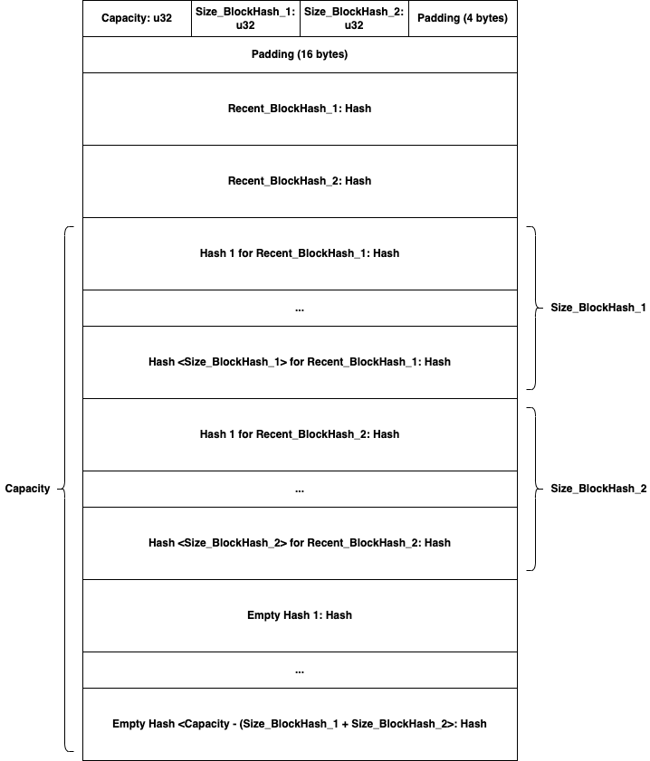
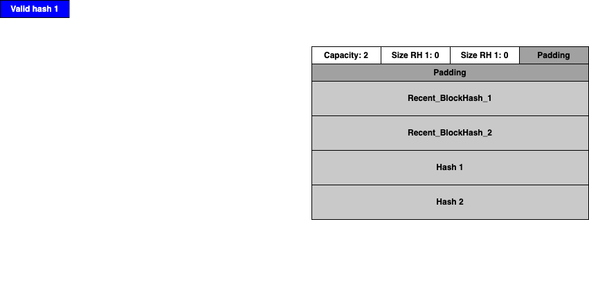

# Here is how the HashStorage struct works

TODO: Good name for this file

TODO: Add drawio for struct layout

TODO: Move other documentation to this file

TODO: Good name for Gif

TODO: Move all the user pda code to its own folder, maybe separate docs from code? Maybe not.

## Description

The purpose of this structure is to allow miners a small overlap of time,
where they can either submit a hash with the old recent_hash or a hash with the new recent_hash, and both are considered valid.
This is to prevent miners from doing useless work or having to spin down briefly once per day as the recent_hash changes.

### insert

The provided hash is checked for validity

If 2 hashes -> 1 hash  
 1. size_hash_2 = 0

If recent_hash_1 is no longer a valid recent_hash
 1. copy all the hashes in the second region to the first region

If the provided hash matches recent_hash_2, 
 1. the hash is stored in the second region, at the end of size, increment size

If the provided hash matches recent_hash_1, then
 1. the first hash in the second region is moved to the end of the second region, the size of the second region does not increment
 2. the hash is stored in the first region, at the end of size, increment size


If the provided hash does not match recent_hash_1 or recent_hash_2, then this triggers the 1 hash -> 2 hashes transition
 1. recent_hash_1 is moved to overwrite recent_hash_2
 2. size_hash_1 is moved to overwrite size_hash_2
 3. the provided recent_hash is stored in recent_hash_1
 4. size_hash_1 is set to 0
 5. from here do the same as if the provided hash matches recent_hash_1

## Memory Layout

  
[ASCII version](#ascii-memory-layout) if the image doesn't work  

## State Machine View

The HashStorage struct can be viewed as a kind of state machine, where the states correspond
to the number of valid hashes, and transitions correspond to legal switches between them.
Possible Events are the states before and after an insert call and correspond to the state
transition(s) they cause. Notably absent is a A,B -> C,D transition, which cannot occur in a
single insert call.

Possible States:  
- No Valid Hashes
- One Valid Hash
- Two Valid Hashes


State Transitions:  
 1. One valid hash -> Two valid hashes 
 2. One valid hash -> One valid hash  
 3. Two valid hashes -> One valid hash  
 4. Two valid hashes -> No valid hashes
 5. No valid hashes -> One valid hash    
 


| Possible Events                                            | State Transitions |
|------------------------------------------------------------|-------------------|
| 1. No valid hashes -> One valid hash                       | (5)               |
| 2. One valid hash -> Same valid hash                       | -                 |
| 3. One valid hash -> Two valid hashes                      | (1)               |
| 4. One valid hash -> New valid hash                        | (2)               |
| 5. Two valid hashes -> Same two valid hashes               | -                 |
| 6. Two valid hashes -> Only the second hash is valid       | (3)               |
| 7. Two valid hashes -> Second valid hash + new valid hash  | (3), (1)          |
| 8. Two valid hashes -> New valid hash                      | (4), (5)          |

### State Transition Diagram

  
[ASCII version](#ascii-state-transition-diagram) if the image doesn't work  

## Gif

  

## ASCII ART

### ASCII Memory Layout

```
+----------------+----------------+----------------+----------------+
|  capacity: u32 |size_hash_1: u32|size_hash_2: u32|     padding    |
+----------------+----------------+----------------+----------------+
|                               padding                             |
+----------------+----------------+----------------+----------------+
|                                                                   |
+                         recent_hash_1: Hash                       +
|                                                                   |
+----------------+----------------+----------------+----------------+
|                                                                   |
+                         recent_hash_2: Hash                       +
|                                                                   |
+----------------+----------------+----------------+----------------+
|                                                                   |
+                           hash_1_1: Hash                          +
|                                                                   |
+----------------+----------------+----------------+----------------+
|                                                                   |
+                                ...                                +
|                                                                   |
+----------------+----------------+----------------+----------------+
|                                                                   |
+                     hash_1_<size_hash_1>: Hash                    +
|                                                                   |
+----------------+----------------+----------------+----------------+
|                                                                   |
+                           hash_2_1: Hash                          +
|                                                                   |
+----------------+----------------+----------------+----------------+
|                                                                   |
+                                ...                                +
|                                                                   |
+----------------+----------------+----------------+----------------+
|                                                                   |
+                     hash_2_<size_hash_2>: Hash                    +
|                                                                   |
+----------------+----------------+----------------+----------------+
|                                                                   |
+                         empty_hash_1: Hash                        +
|                                                                   |
+----------------+----------------+----------------+----------------+
|                                                                   |
+                                ...                                +
|                                                                   |
+----------------+----------------+----------------+----------------+
|                                                                   |
+      empty_hash_<capacity - (size_hash_1 size_hash_2)>: Hash      +
|                                                                   |
+----------------+----------------+----------------+----------------+
```
[^](#memory-layout)  

### ASCII State Transitions Diagram
```
        +-----------------+             
    +-->| One Valid Hash  |-----+       
    |   +-----------------+     |       
    |        ^    ^   |        (1)      
    |        |    |  (2)        |       
    |        |    +---+         |       
    |       (3)                 v       
   (5)       |      +------------------+
    |        +------| Two Valid Hashes |
    |               +------------------+
    |                           |       
    |   +-----------------+    (4)      
    +---| No Valid Hashes |-----+       
        +-----------------+             
```
[^](#state-transition-diagram)  